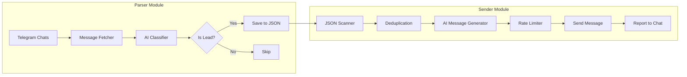
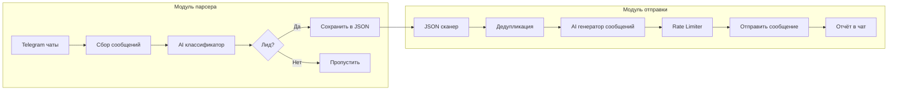

<p align="center">
  
  
  
  
</p>

<h1 align="center">Telegram Lead Parser & Outreach</h1>

<p align="center">
  <b>EN</b> | <a href="#ru">RU</a>
</p>

Automated system for parsing leads from Telegram chats and sending personalized AI-generated outreach messages.

---

## Features

- **Smart Lead Detection** — AI-powered classification of messages (GPT-4o-mini)
- **Multi-Chat Monitoring** — Parse multiple Telegram groups simultaneously
- **Deduplication** — Never message the same person twice
- **Rate Limiting** — Smart delays to avoid Telegram limits
- **Work Window** — Send messages only during business hours
- **Real-time Reports** — Get notified about each sent message
- **Customizable Prompts** — Tune AI behavior via text files

---

## Architecture



---

## Project Structure

```
telegram-lead-parser/
├── src/                          # Parser module
│   ├── app.js                    # Main entry point
│   ├── login.js                  # Telegram authorization
│   ├── core/
│   │   ├── config.js             # Environment configuration
│   │   ├── logger.js             # Pino-based logging
│   │   ├── time.js               # Timezone utilities
│   │   ├── watchdog.js           # Health monitoring
│   │   ├── chats-scanner.js      # Chat discovery
│   │   └── json-messages.js      # JSON file operations
│   ├── filter/
│   │   ├── openai.js             # GPT classifier
│   │   ├── decide.js             # Lead decision logic
│   │   └── rules.js              # Filter rules
│   ├── format/
│   │   └── message.js            # Message formatting
│   └── telegram/
│       ├── client.js             # Telegram client wrapper
│       ├── dialogs.js            # Dialog management
│       ├── fetch.js              # Message fetching
│       ├── link.js               # Link generation
│       ├── send.js               # Message sending
│       └── updates.js            # Real-time updates
│
├── sender/                       # Sender module
│   ├── src/
│   │   ├── app.js                # Main entry point
│   │   ├── sender.login.js       # Sender authorization
│   │   ├── core/
│   │   │   ├── sender-config.js  # Sender configuration
│   │   │   ├── sender-logger.js  # Logging
│   │   │   ├── sender-time.js    # Time utilities
│   │   │   ├── json-scanner.js   # Scans parser output
│   │   │   ├── json-db.js        # Contact database
│   │   │   ├── rate.js           # Rate limiting
│   │   │   ├── checkpoint.js     # Progress tracking
│   │   │   ├── sent-history.js   # Sent message history
│   │   │   ├── openai.js         # Message generation
│   │   │   └── util.js           # Utilities
│   │   ├── inbox/
│   │   │   ├── extractAuthor.js  # Extract message author
│   │   │   └── parseLeadLink.js  # Parse lead links
│   │   ├── outreach/
│   │   │   ├── send.js           # Outreach sender
│   │   │   ├── queue.js          # Send queue
│   │   │   ├── dedupe.js         # Deduplication
│   │   │   └── composer.js       # Message composer
│   │   └── telegram/
│   │       ├── clientParser.js   # Parser client
│   │       ├── clientSender.js   # Sender client
│   │       ├── report.js         # Report client
│   │       ├── links.js          # HTML link builder
│   │       ├── fetchOriginal.js  # Fetch original messages
│   │       └── resolveSenderLink.js
│   └── prompts/
│       └── outreach.txt          # AI prompt for messages
│
├── prompts/
│   └── classifier.txt            # AI prompt for classification
│
├── data/
│   ├── chats.json                # Chat configuration
│   └── filters.json              # Filter rules
│
├── env.example                   # Environment template
├── package.json                  # Dependencies
└── pm2.config.cjs                # PM2 configuration
```

---

## Installation

### Prerequisites

- Node.js >= 18.0.0
- Telegram API credentials ([my.telegram.org](https://my.telegram.org))
- OpenAI API key

### Steps

```bash
# Clone the repository
git clone https://github.com/your-username/telegram-lead-parser.git
cd telegram-lead-parser

# Install parser dependencies
npm install

# Install sender dependencies
cd sender && npm install && cd ..

# Create environment file
cp env.example .env

# Edit .env with your credentials
nano .env
```

---

## Configuration

### Environment Variables

| Variable | Description | Example |
|----------|-------------|---------|
| `TG_API_ID` | Telegram API ID | `12345678` |
| `TG_API_HASH` | Telegram API Hash | `abc123...` |
| `TG_SESSION` | Parser session string | (auto-generated) |
| `TG_PARSER_API_ID` | Parser API ID for sender | `12345678` |
| `TG_PARSER_API_HASH` | Parser API Hash for sender | `abc123...` |
| `TG_PARSER_SESSION` | Parser session for sender | (auto-generated) |
| `TG_SENDER_API_ID` | Sender API ID | `12345678` |
| `TG_SENDER_API_HASH` | Sender API Hash | `abc123...` |
| `TG_SENDER_SESSION` | Sender session string | (auto-generated) |
| `OPENAI_API_KEY` | OpenAI API key | `sk-...` |
| `TARGET_GROUP_ID` | Group for forwarding leads | `-100123456789` |
| `LEAD_INBOX_PEER_ID` | Lead inbox chat ID | `-100123456789` |
| `LEAD_INBOX_TOPIC_ID` | Lead inbox topic ID | `1` |
| `REPORT_PEER_ID` | Report chat ID | `-100123456789` |
| `REPORT_TOPIC_ID` | Report topic ID | `571` |
| `WORK_WINDOW_START` | Sending start time | `09:00` |
| `WORK_WINDOW_END` | Sending end time | `21:00` |

### Chat Configuration

Edit `data/chats.json` to specify which chats to monitor:

```json
{
  "chats": [
    { "id": -1001234567890, "name": "Freelance Chat" },
    { "id": -1009876543210, "name": "Orders Channel" }
  ]
}
```

---

## Usage

### First Run — Authorization

```bash
# Authorize parser account
node src/login.js

# Authorize sender account
cd sender && node src/sender.login.js
```

### Running the System

```bash
# Start parser (monitors chats, classifies leads)
npm run dev

# Start sender (in another terminal)
cd sender && npm run dev
```

### Production (PM2)

```bash
# Start both services
pm2 start pm2.config.cjs

# View logs
pm2 logs

# Stop all
pm2 stop all
```

---

## AI Prompts

### Classifier (`prompts/classifier.txt`)

Determines if a message is a lead. Categories:
- `web` — websites, landing pages
- `bot` — Telegram/WhatsApp bots
- `crm_integration` — CRM, API integrations
- `ai_automation` — AI assistants, automation
- `design` — UI/UX, branding
- `content_media` — video, copywriting
- `marketing` — SEO, ads
- `other` — unclear requests

### Outreach (`sender/prompts/outreach.txt`)

Generates personalized messages. Guidelines:
- 2-3 sentences max
- Reference the client's specific need
- Professional tone, no spam markers
- No portfolio links (except for design)

---

## License

MIT

---

<h1 align="center" id="ru">Telegram Lead Parser & Outreach</h1>

<p align="center">
  <a href="#features">EN</a> | <b>RU</b>
</p>

Автоматическая система для парсинга лидов из Telegram-чатов и отправки персонализированных AI-сообщений.

---

## Возможности

- **Умное определение лидов** — AI-классификация сообщений (GPT-4o-mini)
- **Мониторинг чатов** — Парсинг нескольких групп одновременно
- **Дедупликация** — Исключение повторных сообщений одному человеку
- **Rate Limiting** — Умные задержки для обхода лимитов Telegram
- **Рабочее окно** — Отправка только в рабочие часы
- **Уведомления** — Отчёты о каждой отправке в чат
- **Настраиваемые промпты** — Управление AI через текстовые файлы

---

## Архитектура



---

## Установка

### Требования

- Node.js >= 18.0.0
- Telegram API credentials ([my.telegram.org](https://my.telegram.org))
- OpenAI API ключ

### Шаги

```bash
# Клонировать репозиторий
git clone https://github.com/your-username/telegram-lead-parser.git
cd telegram-lead-parser

# Установить зависимости парсера
npm install

# Установить зависимости sender
cd sender && npm install && cd ..

# Создать файл окружения
cp env.example .env

# Отредактировать .env
notepad .env
```

---

## Настройка

### Переменные окружения

| Переменная | Описание | Пример |
|------------|----------|--------|
| `TG_API_ID` | Telegram API ID | `12345678` |
| `TG_API_HASH` | Telegram API Hash | `abc123...` |
| `TG_SESSION` | Сессия парсера | (генерируется) |
| `TG_SENDER_SESSION` | Сессия отправителя | (генерируется) |
| `OPENAI_API_KEY` | OpenAI API ключ | `sk-...` |
| `TARGET_GROUP_ID` | Группа для пересылки лидов | `-100123456789` |
| `LEAD_INBOX_PEER_ID` | ID чата лидов | `-100123456789` |
| `REPORT_TOPIC_ID` | ID топика для отчётов | `571` |
| `WORK_WINDOW_START` | Начало рабочего окна | `09:00` |
| `WORK_WINDOW_END` | Конец рабочего окна | `21:00` |

### Конфигурация чатов

Редактируйте `data/chats.json`:

```json
{
  "chats": [
    { "id": -1001234567890, "name": "Фриланс чат" },
    { "id": -1009876543210, "name": "Канал заказов" }
  ]
}
```

---

## Использование

### Первый запуск — Авторизация

```bash
# Авторизация аккаунта парсера
node src/login.js

# Авторизация аккаунта отправителя
cd sender && node src/sender.login.js
```

### Запуск системы

```bash
# Запустить парсер
npm run dev

# Запустить sender (в другом терминале)
cd sender && npm run dev
```

### Production (PM2)

```bash
# Запустить оба сервиса
pm2 start pm2.config.cjs

# Просмотр логов
pm2 logs

# Остановить
pm2 stop all
```

---

## AI промпты

### Классификатор (`prompts/classifier.txt`)

Определяет, является ли сообщение лидом. Категории:
- `web` — сайты, лендинги
- `bot` — боты Telegram/WhatsApp
- `crm_integration` — CRM, API интеграции
- `ai_automation` — AI ассистенты, автоматизация
- `design` — UI/UX, брендинг
- `content_media` — видео, копирайтинг
- `marketing` — SEO, реклама
- `other` — неясные запросы

### Outreach (`sender/prompts/outreach.txt`)

Генерирует персонализированные сообщения:
- 2-3 предложения максимум
- Отсылка к конкретному запросу клиента
- Деловой тон, без спам-маркеров
- Без ссылок на портфолио (кроме дизайна)

---

## Лицензия

MIT
